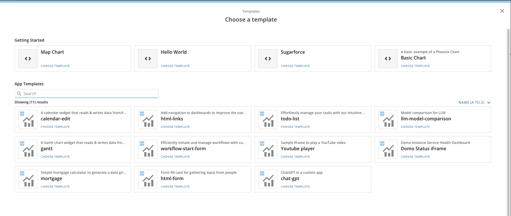
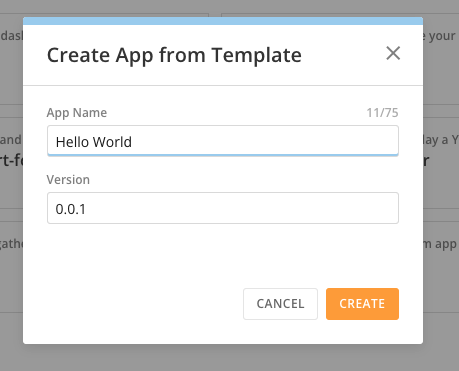
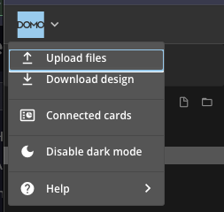
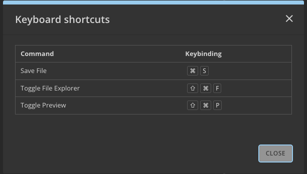
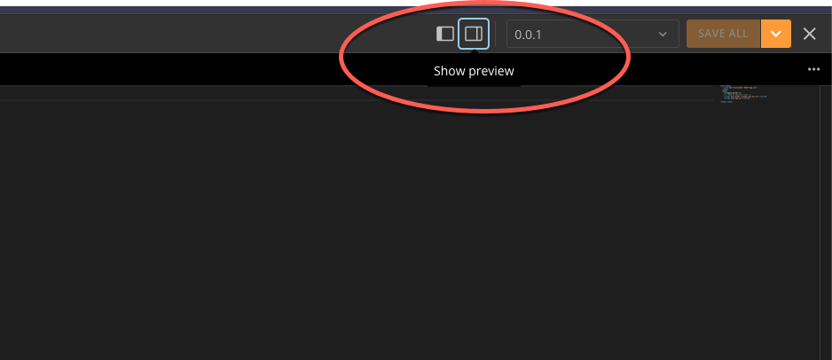
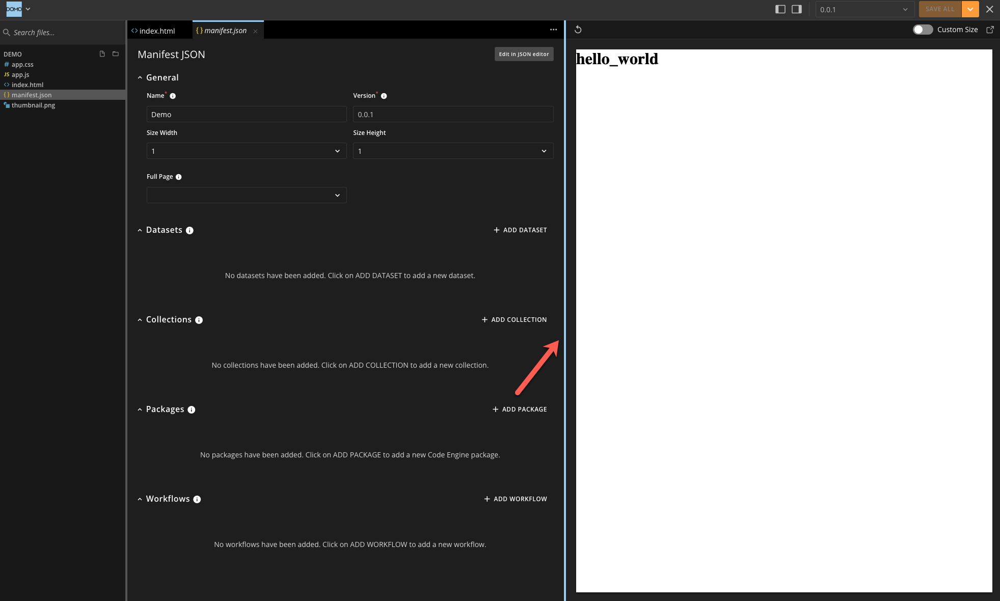

# Getting started with the Pro-Code Editor

## Introduction

The Pro-Code Editor in Domo allows you to create custom applications, enabling more control and flexibility in your design and functionality. Whether you're building a new app from scratch or using a template, this guide will walk you through the initial steps of setting up your app, customizing the editor workspace, and previewing your work.

### 1. Access the Pro-Code Editor

To begin, navigate to the Pro-Code Editor in your Domo instance. You can locate it within the Asset Library by selecting **Pro-Code Apps**.

### 2. Choose a Template

Select a template from the available options to get started with your app. These templates provide various foundational setups, allowing you to jumpstart your development with pre-configured components.

### 3. Name Your App and Set the Version

Give your app a descriptive name and set an initial version number. Establishing a version control strategy from the start will help keep track of updates and changes as your app evolves.

\* *Be aware that when a version is released, that version is locked for viewing only. Each version’s code is distinct, so changes in one version won’t affect others. This allows you to maintain multiple iterations of your app without risk of unintended changes across versions.*

### 4. Customize Your Workspace

Personalize your workspace settings:

- **Theme Settings**: To switch themes or disable dark mode (default), click the Domo logo at the top left.
- **File Upload**: Use this menu to upload any additional files needed for your project, such as images or data files. You can also drag and drop files directly from your computer.

- **Keyboard Shortcuts**: Access available keyboard shortcuts by selecting **Help** in the dropdown menu under the Domo logo.

### 5. Adjust the Layout

The default layout includes a file explorer, editor, and preview window. You can adjust this setup to match your workflow:

- **Hide/Show File Explorer**: Collapse the file explorer to focus on the editor.

- **Open Preview in New Window**: View the preview in a separate window to monitor your app’s appearance and functionality as you work.

- **Hide/Show Preview**: Toggle the preview section on or off as needed to give yourself more screen space.

### 6. Resize the Preview Window

To resize the preview window, hover over the border until the resize icon appears. Drag the border to adjust the window to your preferred size.

### 7. Refresh the Preview

After making changes, use the "Save" keyboard shortcuts or the refresh option to update the preview window with your latest modifications.

### 8. Set Custom Preview Sizes

If your app requires specific display dimensions, toggle the **Custom Size** switch. Define the width and height values, then click **Update** to apply your changes. This is particularly useful for testing responsiveness and layout on different screen sizes.

### Conclusion

The Pro-Code Editor in Domo provides a flexible and powerful environment for creating custom applications. By following these steps, you’ll be able to set up your app, customize your workspace, and preview your work efficiently.
