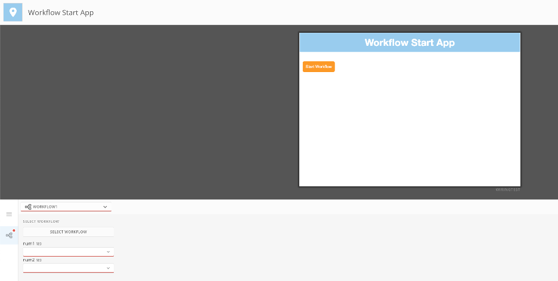
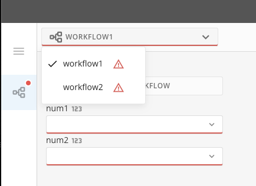
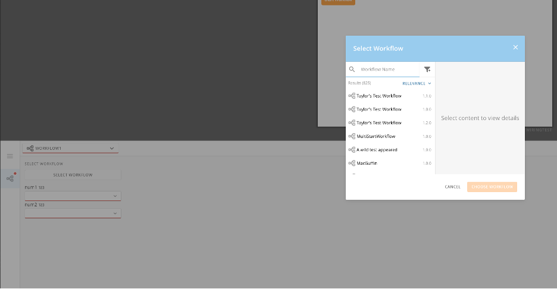
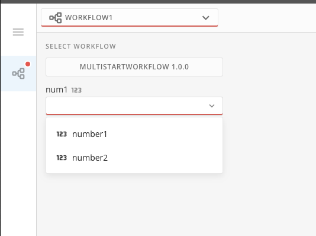

# Start a workflow from an app

Workflows are a powerful way to build action into your apps. You can learn more about [how workflows unlock business process automation in Domo's Knowledge Base](https://domo-support.domo.com/s/article/000005108?language=en_US).

In order to be able to call a workflow from an app, you need to add a workflow mapping definition to your app’s [manifest file](manifest.md) and then wire up a workflow to the app in the wiring screen. To be able to test your workflow locally, please also make sure that you have [configured your app with a `proxyId`](manifest.md#getting-a-proxyid-advanced).

### Manifest

Add a `workflowsMapping` property to the manifest.json file that defines the workflow(s) using the following format:

```json

"workflowsMapping": [
    {
      "alias": "workflow1",
      "modelId": null,
      "version": null,
      "parameters": [
        {
          "name": "num1",
          "aliasedName": "firstNumber",
          "type": "number",
          "list": false,
          "children": []
        },
        {
          "name": "num2",
          "aliasedName": "secondNumber",
          "type": "number",
          "list": false,
          "children": []
        }
      ]
    },
    {
      "alias": "workflow2",
      "parameters": [
        {
          "aliasName": "thing1",
          "type": "number",
          "list": false,
          "value": 2,
          "children": null
        },
        {
          "aliasName": "thing2",
          "type": "number",
          "list": false,
          "children": null
        }
      ]
    }
  ]

```

The `workflowsMapping` property takes an array of workflow mappings. A workflow mapping is an array of objects with the following properties:

- An `alias` (string) - the alias you'd like to use when you reference the workflow in your code.
- A list of input `parameters` required to start the workflow. These parameters include the following properties:
  - `aliasedName`(string) - the alias of the parameter you are passing in to the workflow
  - `type` (string) - type of the parameter you are passing into the workflow. The valid options are:
    - `boolean`
    - `date`
    - `dateTime`
    - `decimal`
    - `duration`
    - `number`
    - `object`
    - `person`
    - `dataset`
    - `group`
    - `text`
    - `time`

  - `list` (boolean) - whether or not the parameter is a list or not.
  - `children` (workflow mapping object) - if the parameter is a defined `object`, you can define the nested properties here.


### Starting a Workflow: Code Example

```js
const startWorkflow = (alias, body) => {
  domo.post(`/domo/workflow/v1/models/${alias}/start`, body)
}

startWorkflow("workflow1", { num1: 10, num2: 20});

```

The `alias` parameter in the `startWorkflow` function is the alias that you defined in your manifest. 

The `body` parameter is an object where the keys match the `aliasedName` keys defined in the `parameters` property of the workflow definition in your manifest. 


### Wiring Screen

After publishing your app, you will need to wire it to the workflow you want to start by editing an existing app card, or creating a new one.



First, choose which workflow you want to wire up. The worklow wiring options that appear in the wiring screen will be the workflows defined in your `workflowMapping` array in your manifest



Next, click "Select Workflow". This will open a modal to choose your workflow version.




Finally, choose your workflow, then wire up the inputs.




Once you're done, click "Save and Finish" and you should now be able to start your workflow from your app.