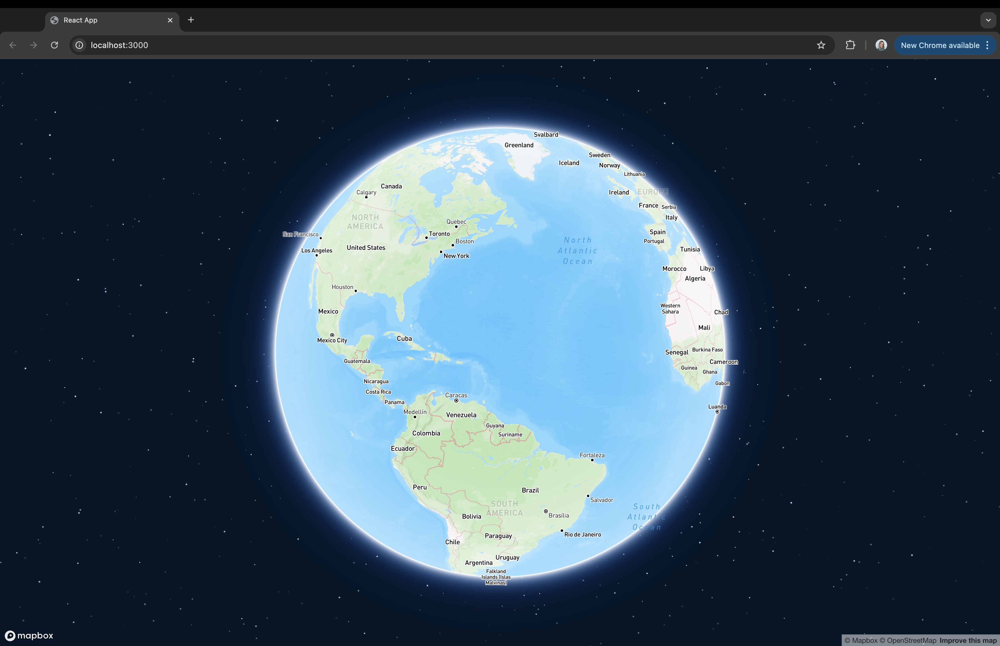
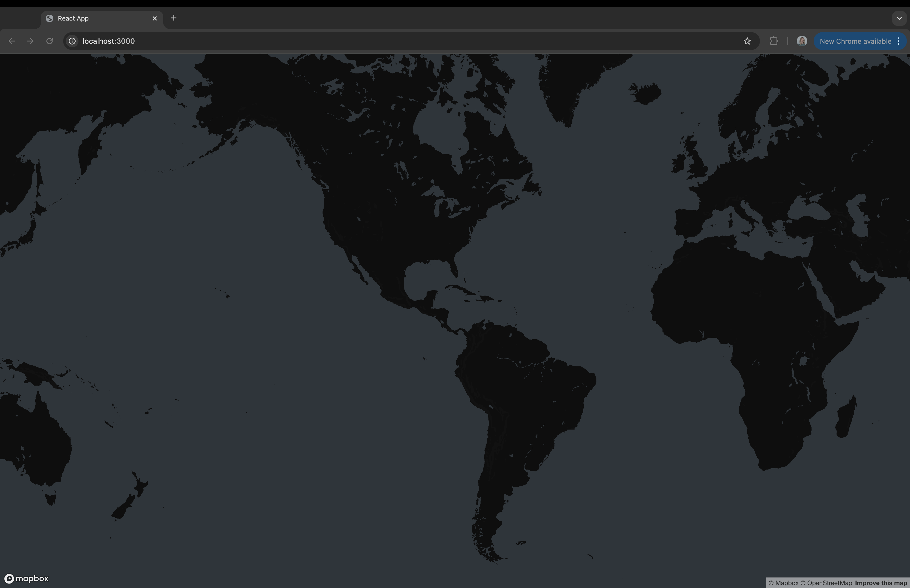
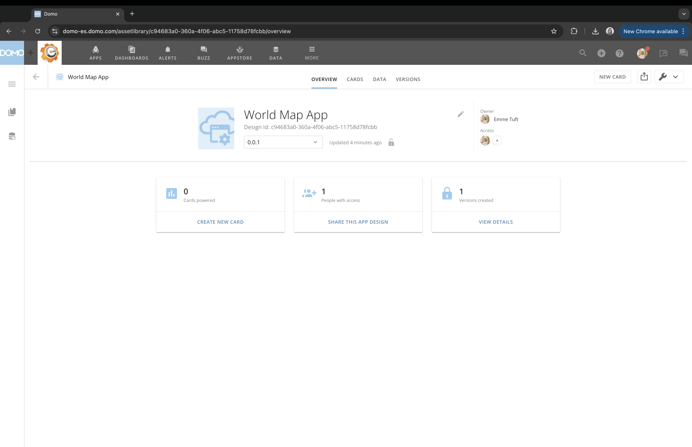
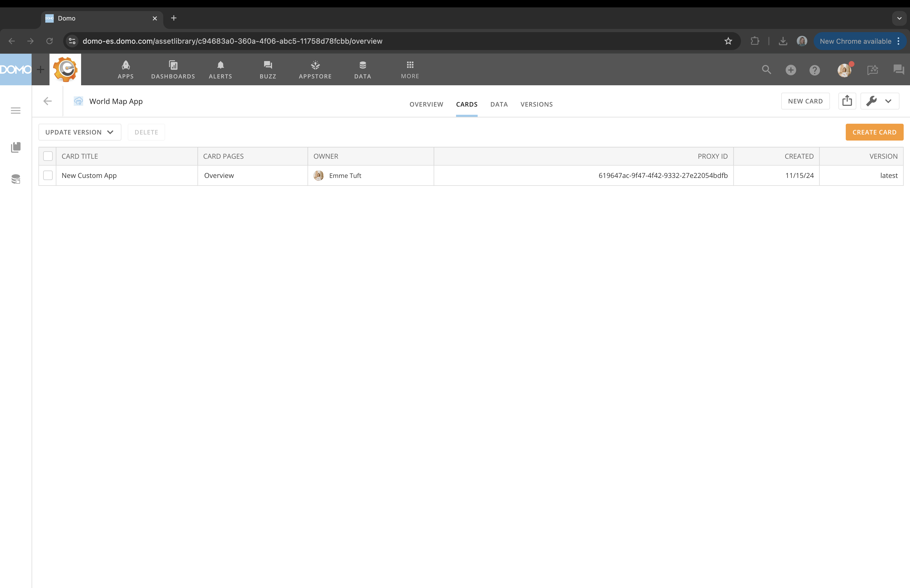
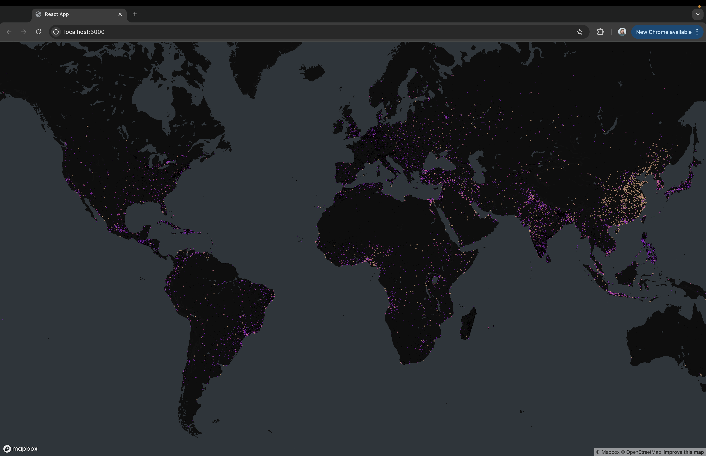

# Maxpbox World Map React App Tutorial

This tutorial will walk you through building a custom React app that displays a world map with data points using Mapbox. As you follow along, you will get experience doing a few things:

- Create a web app from scratch using Domo's React app template
- Use the [Mapbox GL JS](https://docs.mapbox.com/mapbox-gl-js/guides) library to build a custom map
- Wire the app to a dataset in Domo and fetch data to add points to the map

### Step 1: Setup and Installation

---

Before beginning, please make sure you’ve successfully installed the Domo Apps CLI and followed the basic setup and installation instructions found [here](https://developer.domo.com/docs/dev-studio-quick-start/set-up). When following the article, please skip `Step 3: Create a New App`. We will be creating a React app instead of a simple Javascript app.

### Step 2: Create and Run a New React Project

---

Initialize a React project using Domo's template by following the steps in [this article](https://developer.domo.com/portal/u8w475o2245yp-starter-kits). Run the `yarn start` (or `npm start`) command to start developing locally.

### Step 3: Sign Up for a Free Mapbox Account

---

If you don't already have a Mapbox account, you can create one for free [here](https://account.mapbox.com/auth/signup/). This is a requirement to get your own custom app running with Mapbox. Once you've created your account, you should be able to get your personal `Access tokens` at the bottom of your account home screen. If you're having trouble finding them, or you'd like to learn more about access tokens, read Mapbox's support article on [Access Tokens](https://docs.mapbox.com/help/getting-started/access-tokens/).

### Step 4: Set Up App Components

---

Open the `public` and `src` folders to see the files that were auto-generated for you in Step 2. For this tutorial, we will only make changes to the `App.js`, `App.css`, and `manifest.json` files.

- `App.js` and `App.css` will contain the code to build the mapbox app and style it how we want.

- The `manifest.json` file is a special Domo file that is required for building apps on the Domo App Framework. We will use this file to wire our app to a dataset in Domo. [What is the manifest file?](https://developer.domo.com/portal/af407395c766b-the-manifest-file)

To start, we will update the contents of `App.js` to include a container div for a map. We will also add a couple of refs to control the content of our container. Replace everything inside of `App.js` with the following lines of code:

```javascript
import React, { useRef } from "react";
import "./App.css";

function App() {
  const mapRef = useRef(null);
  const mapContainerRef = useRef(null);

  return (
    <div id="map-container" className="mapContainer" ref={mapContainerRef} />
  );
}

export default App;
```

Next, replace the contents of `App.css` with this simple CSS class:

```css
.mapContainer {
  height: 100vh;
  width: 100vw;
}
```

### Step 5: Instantiate Mapbox

---

First, install the `mapbox-gl` package using either `yarn` or `npm`. Run one of the following commands in your terminal from the context of your app.

`$ yarn add mapbox-gl` or `$ npm install mapbox-gl`

Next, add the following imports to the very top of your `App.js` file to bring in the Mapbox GL JS library and dependencies.

```javascript
import mapboxgl from "mapbox-gl";
import "mapbox-gl/dist/mapbox-gl.css";
```

We are now going to add a `useEffect` to our component to instantiate an instance of Mapbox once our component has loaded into the DOM and is ready to render the map. Below your `useRef` lines of code, add the following snippet:

```javascript
useEffect(() => {
  mapboxgl.accessToken = "YOUR_MAPBOX_ACCESS_TOKEN";

  mapRef.current = new mapboxgl.Map({
    container: mapContainerRef.current,
  });

  return () => {
    mapRef.current.remove();
  };
}, []);
```

Replace `YOUR_MAPBOX_ACCESS_TOKEN` with your own personal Mapbox access token. You should have seen this when completing Step 3. This will give your app the access it needs to interact with the Mapbox GL JS library.

Once you've followed all of these steps, your `App.js` file should look like this:

```javascript
import React, { useEffect, useRef } from "react";
import "./App.css";
import mapboxgl from "mapbox-gl";
import "mapbox-gl/dist/mapbox-gl.css";

function App() {
  const mapRef = useRef(null);
  const mapContainerRef = useRef(null);

  useEffect(() => {
    mapboxgl.accessToken = "YOUR_MAPBOX_ACCESS_TOKEN";

    mapRef.current = new mapboxgl.Map({
      container: mapContainerRef.current,
    });

    return () => {
      mapRef.current.remove();
    };
  }, []);

  return (
    <div id="map-container" className="mapContainer" ref={mapContainerRef} />
  );
}

export default App;
```

If you're not already running your local development environment, run the start command in your terminal.

`yarn start` or `npm start`

Check your browser at `localhost:3000`, where your app should be running. You should see an interactive globe map. You can use your scroll wheel to zoom in and out, and you can drag the globe to rotate it.



### Step 6: Style Map and Add a Few Points

---

Mapbox provides a way to create custom map styles inside their Mapbox Studio feature. We won't be building one in this tutorial, but you can find out how to do it yourself by following their guide, [Create a custom style](https://docs.mapbox.com/help/tutorials/create-a-custom-style/).

We've created a simple custom style already and we are providing you the json file that will allow you to use it in your app. **Please download the file <a href="../../../../../assets/files/map-style.json" download>here</a>.**

You'll want to add the `map-style.json` file to your `src` folder. Then, bring it into your app by adding this line of code at the top of your `App.js` file:

```javascript
import rawMapStyle from "./map-style.json";
```

Then, to implement the custom style, update your Mapbox instantiation within the useEffect:

```javascript
mapRef.current = new mapboxgl.Map({
  container: mapContainerRef.current,
  style: rawMapStyle,
  maxBounds: [
    [-230, -60], // Southwest corner (hide Antarctica)
    [230, 70], // Northeast corner (keep map within bounds)
  ],
});
```

If you return to your browser, your app should now look like this:



Our custom style converts the map from a globe to a cartesian map, where it appears to be laying flat. We also set some dark colors for the land and sea.

Now, we're going to add a few sample data points to our map. Let's put 10 major U.S. cities on the map.

Add this city data array above your useEffect:

```javascript
const points = [
  {
    name: "Chicago",
    latitude: 41.8781,
    longitude: -87.6298,
    radius: 3,
    color: "#A221B9",
  },
  {
    name: "Dallas",
    latitude: 32.7767,
    longitude: -96.797,
    radius: 3,
    color: "#A221B9",
  },
  {
    name: "Houston",
    latitude: 29.7604,
    longitude: -95.3698,
    radius: 3,
    color: "#A221B9",
  },
  {
    name: "Los Angeles",
    latitude: 34.0522,
    longitude: -118.2437,
    radius: 3,
    color: "#A221B9",
  },
  {
    name: "New York",
    latitude: 40.7128,
    longitude: -74.006,
    radius: 3,
    color: "#A221B9",
  },
  {
    name: "Philadelphia",
    latitude: 39.9526,
    longitude: -75.1652,
    radius: 3,
    color: "#A221B9",
  },
  {
    name: "Phoenix",
    latitude: 33.4484,
    longitude: -112.074,
    radius: 3,
    color: "#A221B9",
  },
  {
    name: "San Antonio",
    latitude: 29.4241,
    longitude: -98.4936,
    radius: 3,
    color: "#A221B9",
  },
  {
    name: "San Diego",
    latitude: 32.7157,
    longitude: -117.1611,
    radius: 3,
    color: "#A221B9",
  },
  {
    name: "San Jose",
    latitude: 37.3382,
    longitude: -121.8863,
    radius: 3,
    color: "#A221B9",
  },
];
```

Next, we'll add some code to our `useEffect` that will iterate over the cities and turn them into points on our map. Mapbox uses the `latitude` and `longitude` of our data points to position elements on the map. We are telling Mapbox to add a layer of circles using our data, and then we pass the radius, color, and opacity to customize the look. Update your `useEffect` to look like this:

```javascript
useEffect(() => {
  mapboxgl.accessToken = "YOUR_MAPBOX_ACCESS_TOKEN";

  mapRef.current = new mapboxgl.Map({
    container: mapContainerRef.current,
    style: rawMapStyle,
    maxBounds: [
      [-230, -60], // Southwest corner (hide Antarctica)
      [230, 70], // Northeast corner (keep map within bounds)
    ],
  });

  // After the map loads, add data points
  mapRef.current.on("load", () => {
    const dataPoints = {
      type: "FeatureCollection",
      features: points.map((point) => ({
        type: "Feature",
        geometry: {
          type: "Point",
          coordinates: [point.longitude, point.latitude],
        },
        properties: {
          name: point.name,
          radius: point.radius,
          color: point.color,
        },
      })),
    };

    // Add the source
    mapRef.current.addSource("dataPoints", {
      type: "geojson",
      data: dataPoints,
    });

    // Add a circle layer
    mapRef.current.addLayer({
      id: "circle-layer",
      type: "circle",
      source: "dataPoints",
      paint: {
        "circle-radius": ["get", "radius"], // Circle radius
        "circle-color": ["get", "color"], // Circle color
        "circle-opacity": 0.7, // Circle opacity
      },
    });
  });

  return () => {
    mapRef.current.remove();
  };
}, []);
```

Save your changes and check the browser. You should see our 10 U.S. cities on the map as little magenta circles.


### Step 7: Wire Data to Our App

---

Now that we have our map looking how we want it, it's time to add some real data to it. Building Domo apps on the App Framework becomes the most powerful when we're able to leverage connections with your data via wiring to DataSets, AppDB collections, Workflows, and more. For this tutorial, we will be wiring our app to a DataSet that contains population data for cities all over the world.

First, you will want to [**download the DataSet here**](../../../../../assets/files/World_Cities.csv).

Then, upload the DataSet to your Domo instance. Go to the `Data` tab in Domo, click on `CONNECT DATA` at the top of the screen, then select `Upload a spreadsheet`. You'll then be able to select the file from your machine or drag and drop into the UI. Click through the file upload screens and save the dataset without making any modifications.

Now, return to your app and open the `manifest.json` file. We're going to add an entry to the `mapping` property for the dataset we just created in Domo. Update the contents of your `manifest.json` file to look like this:

```json
{
  "name": "World Map App",
  "version": "0.0.1",
  "size": {
    "width": 3,
    "height": 3
  },
  "mapping": [
    {
      "alias": "geoData",
      "dataSetId": "YOUR_DATASET_ID",
      "fields": [
        {
          "alias": "id",
          "columnName": "id"
        },
        {
          "alias": "city",
          "columnName": "city"
        },
        {
          "alias": "country",
          "columnName": "country"
        },
        {
          "alias": "lat",
          "columnName": "lat"
        },
        {
          "alias": "long",
          "columnName": "lng"
        },
        {
          "alias": "dataPoint",
          "columnName": "population"
        }
      ]
    }
  ]
}
```

Replace `YOUR_DATASET_ID` with the unique ID for the dataset you created in your Domo instance a moment ago. You can find the ID in the URL bar when viewing the dataset.


Before we can query this dataset locally, we'll need to upload our app to Domo in order to establish the connection we've added to the `manifest.json` file. Let's do that now.

Login to your Domo instance from the command line by running this command:

`domo login`

You will be prompted to select a Domo instance, or enter a new one. Enter your assigned instance URL and then press enter (e.g. 'my_company.domo.com'). You'll then be presented with a login screen and the Domo CLI will be authorized on your instance.

Next, run `yarn upload` or `npm upload`.

This will build your project and create a new app Design in your Domo instance. If the command runs successfully, you'll see something like this in your terminal when it's finished:


Now, let's find the newly created Design in your Domo instance. Return to Domo in the browser, click on the `MORE` option at the top, and select `Asset Library`. You should be able to find your World Map App here. Click on the asset to open its details. Below the name of the asset, you'll see a `Design Id`. Copy that.



Return to your app so we can add the `Design Id` to the `manifest.json` file. After the closing square brackets of your `mapping` property, add a comma and a new line. Then, add this line of code:

```json
"id": "YOUR_DESIGN_ID"
```

Next, we'll create a new card from our asset in Domo that will act as a proxy while we're developing locally. Since Domo is unaware of your local dev environment, it doesn't know which mappings to use unless you connect Domo entities (like DataSets and Workflows) to a Domo card.

From your World Map App Design page, click on the `Cards` tab at the top, and then select `Create Card` in the top right. This will open the card details screen. From this view, you should see a preview of your App as well as all of the Domo entities that are/can be wired to it. Since we added our DataSet Id to our `manifest.json` file earlier, you should see that the `World_Cities.csv` file is wired to your app. If not, you can select it manually.

Click `Save & Finish` in the top right to save your new Card.

Now, return to the `Asset Library` and find your Design again. Click on the `Cards` tab at the top and you should see your newly created card. Find the `Proxy Id` property and copy that value.



Return to the `manifest.json` file in your app and add another line below the previous addition:

```json
"proxyId": "YOUR_PROXY_ID"
```

Once all is said and done, your `manifest.json` file should look something like this:

```json
{
  "name": "World Map App",
  "version": "0.0.1",
  "size": {
    "width": 3,
    "height": 3
  },
  "mapping": [
    {
      "alias": "geoData",
      "dataSetId": "08a9f9eb-b7c3-4066-abba-47875733b0de",
      "fields": [
        {
          "alias": "id",
          "columnName": "id"
        },
        {
          "alias": "city",
          "columnName": "city"
        },
        {
          "alias": "country",
          "columnName": "country"
        },
        {
          "alias": "lat",
          "columnName": "lat"
        },
        {
          "alias": "long",
          "columnName": "lng"
        },
        {
          "alias": "dataPoint",
          "columnName": "population"
        }
      ]
    }
  ],
  "id": "c94683a0-360a-4f06-abc5-11758d78fcbb",
  "proxyId": "619647ac-9f47-4f42-9332-27e22054bdfb"
}
```

Now we're ready to query the dataset from our app!

### Step 8: Query Data and Render Points on the Map

---

We are going to use the Domo CLI (aka `ryuu.js` from within an app) to fetch data from our instance. [What is the Domo CLI?](https://developer.domo.com/portal/rmfbkwje8kmqj-domo-apps-cli)

Install the library using `yarn add ryuu.js` or `npm install ryuu.js`

Then, import it into your app by adding this line at the top of your `App.js` file:

```javascript
import domo from "ryuu.js";
```

Add a new `useEffect` to your component that uses `domo.get` to fetch data from the World_Cities DataSet.

```javascript
useEffect(() => {
  const fetchData = async () => {
    const response = await domo.get("/data/v1/geoData");
    console.log(response);
  };

  fetchData();
}, []);
```

We are using the Data API for the App Framework, which is [documented here](https://developer.domo.com/portal/8s3y9eldnjq8d-data-api). This `GET` endpoint uses the dataset `alias`, which we set in our `manifest.json` file. We set the `alias` as `geoData`, but you can set it to whatever you'd like.

Make sure your app is running in the browser and refresh the page. In your Javascript console, you should see over 45,000 rows of data being printed (you can open the console by right-clicking on the screen and clicking `Inspect`). This is just a quick check to make sure our data is being fetched as expected, but now we're going to add the data to our map.

We're going to add a few things here. Add a `useState` to store our data points below our `useRef` lines, then set the points after fetching the data. Also create a couple of helper functions to determine each point's radius and color.

```javascript
function App() {
  const mapRef = useRef(null);
  const mapContainerRef = useRef(null);

  const [points, setPoints] = useState([]);

  const POPULATION_LIMIT = 50000;
  const POINT_STEP = 100000;

  const getPointRadius = (row) => {
    const step = Math.min(
      Math.floor((row.dataPoint - POPULATION_LIMIT) / POINT_STEP),
      3
    );
    return 1 + step * 0.2;
  };

  const getPointColor = (row) => {
    const step = Math.min(
      Math.floor((row.dataPoint - POPULATION_LIMIT) / POINT_STEP),
      4
    );
    const colors = ["#8F1CCD", "#A221B9", "#E0329D", "#DF7B90", "#E8AD85"];
    return colors[step];
  };

  useEffect(() => {
    const fetchData = async () => {
      const response = await domo.get("/data/v1/geoData");
      const data = response.map((data) => ({
        name: data.city,
        latitude: data.lat,
        longitude: data.long,
        radius: getPointRadius(data),
        color: getPointColor(data),
      }));
      setPoints(data);
    };

    fetchData();
  }, []);

  ...
```

Then, adjust your big `useEffect` (the one that renders the map) to make it dependent on our `points` array and prevent it from rendering anything before the data is ready.

```javascript
useEffect(() => {
  if (points.length === 0) return;

  mapboxgl.accessToken = "YOUR_MAPBOX_ACCESS_TOKEN";

    ...

  return () => {
    mapRef.current.remove();
  };
}, [points]);
```

That's all the code! Your `App.js` file should end up looking like this:

```javascript
import React, { useEffect, useRef, useState } from "react";
import domo from "ryuu.js";
import mapboxgl from "mapbox-gl";
import "mapbox-gl/dist/mapbox-gl.css";
import rawMapStyle from "./map-style.json";
import "./App.css";

function App() {
  const mapRef = useRef(null);
  const mapContainerRef = useRef(null);

  const [points, setPoints] = useState([]);

  const POPULATION_LIMIT = 50000;
  const POINT_STEP = 100000;

  const getPointRadius = (row) => {
    const step = Math.min(
      Math.floor((row.dataPoint - POPULATION_LIMIT) / POINT_STEP),
      3
    );
    return 1 + step * 0.2;
  };

  const getPointColor = (row) => {
    const step = Math.min(
      Math.floor((row.dataPoint - POPULATION_LIMIT) / POINT_STEP),
      4
    );
    const colors = ["#8F1CCD", "#A221B9", "#E0329D", "#DF7B90", "#E8AD85"];
    return colors[step];
  };

  useEffect(() => {
    const fetchData = async () => {
      const response = await domo.get("/data/v1/geoData");
      const data = response.map((data) => ({
        name: data.city,
        latitude: data.lat,
        longitude: data.long,
        radius: getPointRadius(data),
        color: getPointColor(data),
      }));
      setPoints(data);
    };

    fetchData();
  }, []);

  useEffect(() => {
    if (points.length === 0) return;

    mapboxgl.accessToken = "YOUR_MAPBOX_ACCESS_TOKEN";

    mapRef.current = new mapboxgl.Map({
      container: mapContainerRef.current,
      style: rawMapStyle,
      maxBounds: [
        [-230, -60], // Southwest corner (hide Antarctica)
        [230, 70], // Northeast corner (keep map within bounds)
      ],
    });

    // After the map loads, add data points
    mapRef.current.on("load", () => {
      const dataPoints = {
        type: "FeatureCollection",
        features: points.map((point) => ({
          type: "Feature",
          geometry: {
            type: "Point",
            coordinates: [point.longitude, point.latitude],
          },
          properties: {
            name: point.name,
            radius: point.radius,
            color: point.color,
          },
        })),
      };

      // Add the source
      mapRef.current.addSource("dataPoints", {
        type: "geojson",
        data: dataPoints,
      });

      // Add a circle layer
      mapRef.current.addLayer({
        id: "circle-layer",
        type: "circle",
        source: "dataPoints",
        paint: {
          "circle-radius": ["get", "radius"], // Circle radius
          "circle-color": ["get", "color"], // Circle color
          "circle-opacity": 0.7, // Circle opacity
        },
      });
    });

    return () => {
      mapRef.current.remove();
    };
  }, [points]);

  return (
    <div id="map-container" className="mapContainer" ref={mapContainerRef} />
  );
}

export default App;
```

Return to the browser and look at your finished map (you may need to refresh). You should see thousands of points all over the map, where the size and color of each point is determined by the population size of the city. How beautiful and interesting!



Congratulations! You've completed this tutorial. Now that you know how to wire an app to a DataSet and how to render a map from Mapbox, you might have more ideas of how you could use these features to your benefit. A map like this can be further iterated on to add hover interactions to display data, to give one example.

We hope you enjoyed building your own custom app and invite you to continue from here. Check out the [Mapbox documentation](https://docs.mapbox.com/) if you'd like to add more to your map. [Reach out to us](https://www.domo.com/login/customer-community) with questions and get involved with the Domo community to see how others are building custom apps like this one.
