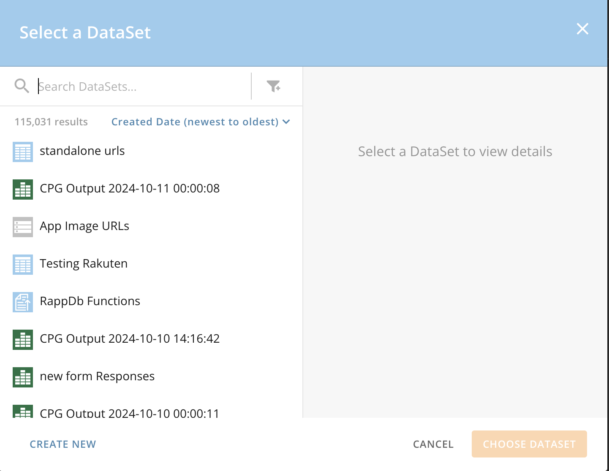
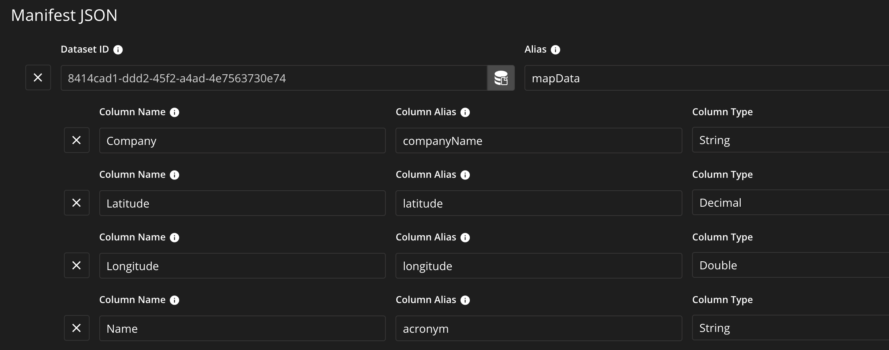

# Converting a Brick into a Pro-Code App

### **Prerequisites**

- Access to Domo's Pro-Code Editor.
  - Ensure that Pro-Code Editor is enabled in your Domo instance. After 11/13/2024, it will be automatically enabled.
- Access to any dataset referenced in the Brick being migrated.

---

You can convert your Brick **semi-automatically** with the “Convert to App” button or **manually** by copying and pasting.

<!--
type: tab
title: Semi-automatically
-->

### 1. Start the conversion

1. **Edit** your Brick
1. Click the “**Convert to App**” button in the header.

<!-- theme: info -->
> #### Dataset Configuration Transfer
>
> Notice that upon converting, the datasets you had wired previously have **automatically** been **transferred** to your [manifest.json]

### 2. Replace `window.datasets`

Bricks use the `window.datasets` global property to execute a Configuration-driven design paradigm, while the Pro-Code Editor leverages a [manifest.json] file to implement a Metadata-driven design strategy.

[manifest.json]: https://developer.domo.com/portal/af407395c766b-the-manifest-file

To make the switch, you'll need to **replace** any usages of `window.datasets` with the corresponding dataset **aliases** (found in your [manifest.json]).

#### The Lowest-Touch Approach

The simplest approach is to replace all instances of `window.datasets` with an **array of strings** corresponding to your aliases.

So change

`var datasets = window.datasets;`

to something like

`var datasets = ['sales', 'profit'];`

As long as you've kept the order the same, that should be sufficient.

<!--
type: tab
title: Manually
-->

### 1. Begin by setting up your Pro-Code Application

- In a separate window, navigate to the Asset Library, click the “Pro-Code Editor” button, and choose “Blank Template.”
  - By default, you will already have the app.css, app.js, index.html, and manifest.json files provided.

### 2. Copy your code into the Pro-Code Editor

- Manual Copy & Paste
  - Copy the HTML from your Brick and paste it into the index.html file in the Pro-Code Editor.
  - Update the `<link>` and `<script>` tags that previously referenced your local resources to now reference “app.css” and “app.js” respectively.
  - Now copy your JavaScript code from the Brick and paste it into the app.js file of the Pro-Code Editor.
  - Finally, copy your CSS from the Brick and paste it into app.css in the Pro-Code Editor.

### 3. Next, migrate any required datasets

Bricks uses the `window.datasets` global property to execute a Configuration-driven design paradigm, while the Pro-Code Editor leverages a [manifest.json] file to implement a Metadata-driven design strategy.

- Review your code and identify all required datasets.
- Select the “manifest.json” file and use the “+ Add Dataset” button.
- Click the icon in the dataset ID input field.

### 4. Select your dataset from the modal:

### 5. Create an alias for the dataset ID

- This will be used to humanize your API calls to the [DataSet endpoint(s)](https://developer.domo.com/portal/8s3y9eldnjq8d-data-api).

- In this example, the alias we chose was “mapData” – you will need to update your API calls to use this alias for your dataset.

### 6. Create an alias for each Column Name that you will be using.

_Note: It is not required to have all columns listed. Additionally, the Pro-Code Editor includes a 'sync' feature that will automatically populate the list of columns and their aliases for you!_

- Ensure that your new aliases do not have any spaces in them, as the Pro-Code Editor will not allow it.

### 7. Update the dataset references

- Ensure all API calls now reference the corresponding alias for that dataset.
- Ensure all references to the data model properties are updated to match the alias of the column names you specified.

Here is an example from a common Brick Template. In this example the original code is on the top with the updated code on the bottom:

You won’t need any references to `window.datasets`, so be sure to remove that reference and verify the application is working as expected!

<!-- type: tab-end -->

## Conclusion:

After you're done, test your application to ensure normal functionality, and ensure all data is able to be accessed correctly.
