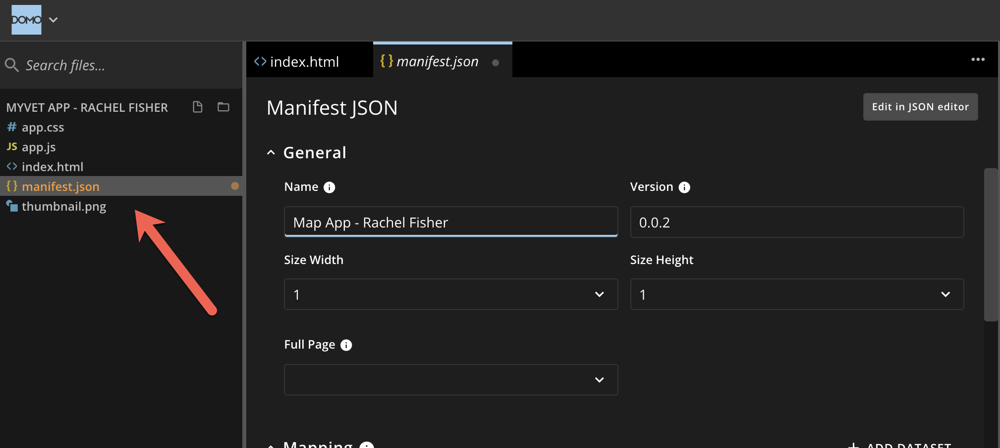

# Converting a Brick into a Pro-Code App

### **Prerequisites**

- Access to Domo's Pro-Code Editor.
  - Ensure that Pro-Code Editor is enabled in your Domo instance. After 11/13/2024, it will be automatically enabled.
- Access to any dataset referenced in the Brick being migrated.

---

<!--
type: tab
title: Convert Button
-->

The contents of tab 1.

<!--
type: tab
title: Copy & Paste
-->

The contents of tab 2.

<!-- type: tab-end -->

### 1. Begin by setting up your Pro-Code Application

- Edit your Brick and click the “Convert to App” button in the header.
- In a separate window, navigate to the Asset Library, click the “Pro-Code Editor” button, and choose “Blank Template.”
  - By default, you will already have the app.css, app.js, index.html, and manifest.json files provided.

### 2. Copy your code into the Pro-Code Editor

- If you chose the “Convert to Brick” option, and it successfully created your app, you will be automatically routed to the Pro-Code Editor, with your application already loaded. In this case, proceed to step 3.
- Manual Copy & Paste
  - Copy the HTML from your Brick and paste it into the index.html file in the Pro-Code Editor.
  - Update the `<link>` and `<script>` tags that previously referenced your local resources to now reference “app.css” and “app.js” respectively.
  - Now copy your JavaScript code from the Brick and paste it into the app.js file of the Pro-Code Editor.
  - Finally, copy your CSS from the Brick and paste it into app.css in the Pro-Code Editor.

### 3. Next, migrate any required datasets

Bricks uses the `window.datasets` global property to execute a Configuration-driven design paradigm, while the Pro-Code Editor leverages a [manifest.json](https://developer.domo.com/portal/af407395c766b-the-manifest-file) file to implement a Metadata-driven design strategy.

- Review your code and identify all required datasets.
- Select the “manifest.json” file and use the “+ Add Dataset” button.
- Click the icon in the dataset ID input field.

### 4. Select your dataset from the modal:

### 5. Create an alias for the dataset ID

- This will be used to humanize your API calls to the [DataSet endpoint(s)](https://developer.domo.com/portal/8s3y9eldnjq8d-data-api).

- In this example, the alias we chose was “mapData” – you will need to update your API calls to use this alias for your dataset.

### 6. Create an alias for each Column Name that you will be using.

_Note: It is not required to have all columns listed. Additionally, the Pro-Code Editor includes a 'sync' feature that will automatically populate the list of columns and their aliases for you!_

- Ensure that your new aliases do not have any spaces in them, as the Pro-Code Editor will not allow it.

### 7. Update the dataset references

- Ensure all API calls now reference the corresponding alias for that dataset.
- Ensure all references to the data model properties are updated to match the alias of the column names you specified.

Here is an example from a common Brick Template. In this example the original code is on the top with the updated code on the bottom:

## Conclusion:

After this has been updated, test your application to ensure normal functionality, and ensure all data is able to be accessed correctly. You won’t need any references to “window.dataset,” so be sure to remove that reference and verify the application is working as expected!
