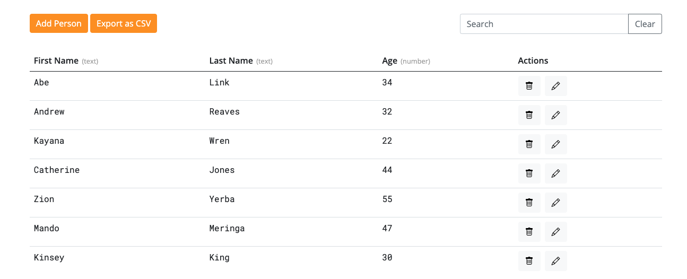
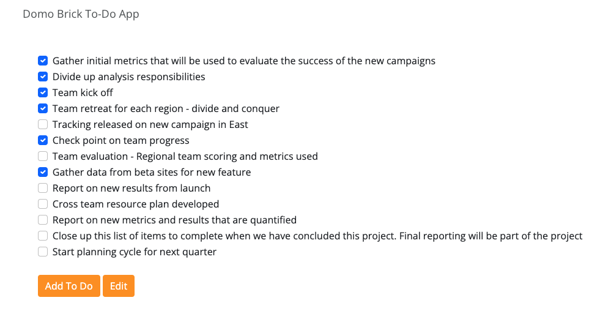
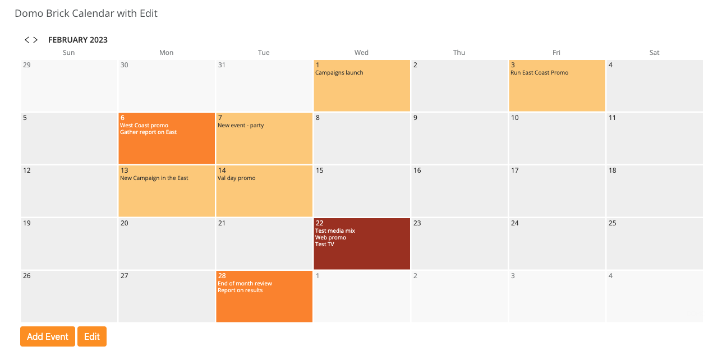
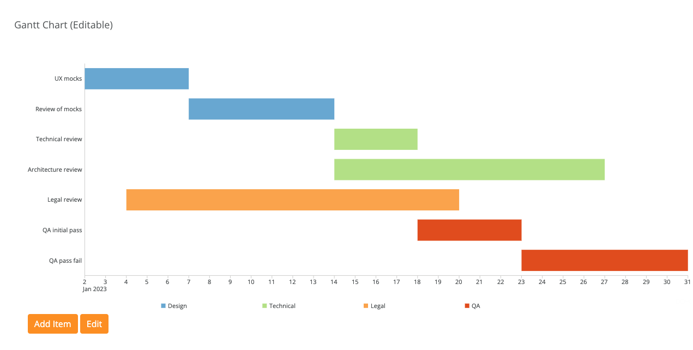
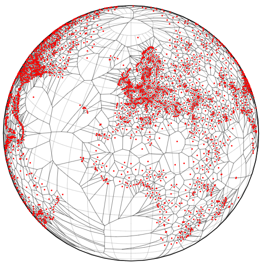
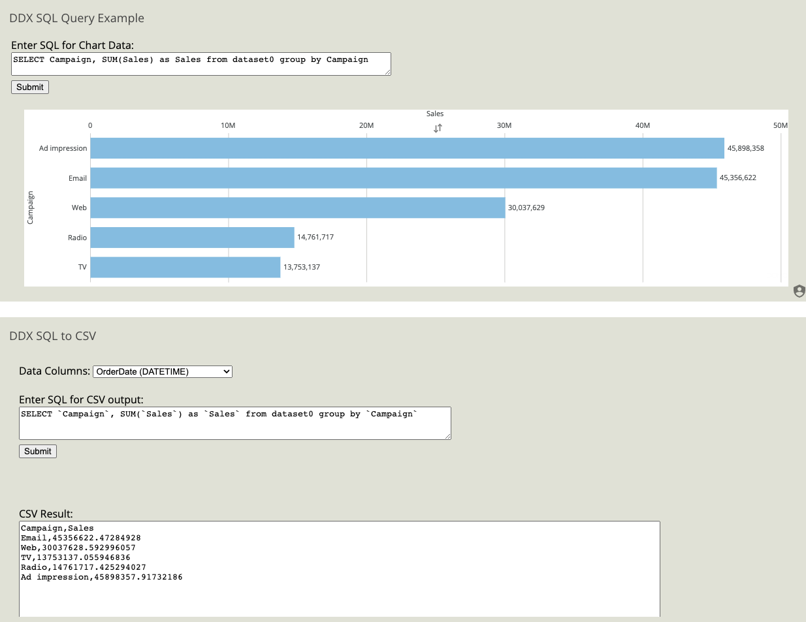
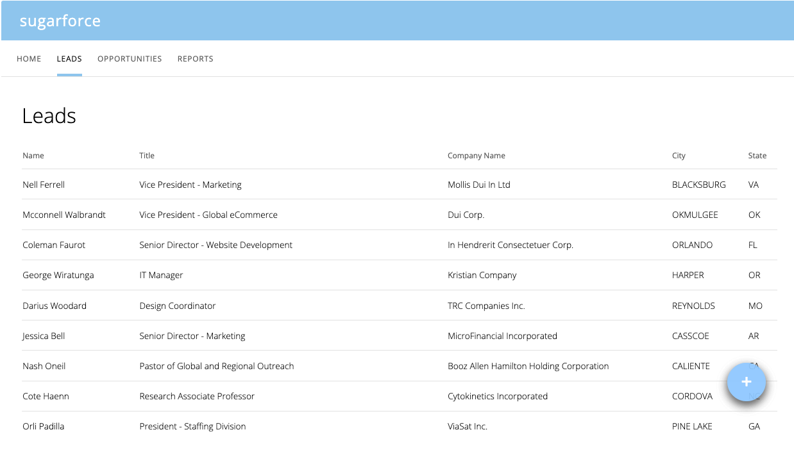

# Domo Bricks Overview

### What are Domo Bricks?
---
Domo Bricks are pre-built objects that allow you to find and act more quickly on custom business insights.

With Domo Bricks, business users, citizen developers, and full stack developers can quickly iterate, prototype and compose new apps with beautiful and advanced features to discover new insights from custom visualization and interactions. 

You can choose from Bricks available in the Domo Appstore or you can also use Domo Bricks to render a new library you found online -- it's as easy as copy and paste.

Domo Bricks lets you use HTML, CSS and JS to completely customize your app. These new custom solutions visuals are immediately rendered and can be easily updated all within your Domo instance.

Now there is a seamless path for business users to progress from out-of-the box app building constraints to scalable, powerful, customized objects that extend Domo to meet any business need.

### Example Use Cases
---

<h4><strong>Domo Bricks allow you to:</strong></h4>
<ul>
 	<li>Quickly prototype and iterate from an infinite number of possible business applications</li>
 	<li>Build an application from scratch using HTML, CSS and JS tied to Domo data</li>
 	<li>Copy and paste examples from the web to customize your dashboard</li>
 	<li>Build a brand new chart type by using your favorite UI library tied to Domo data</li>
 	<li>Leverage D3 snippets to create innovative new data visualizations or specialized UI components</li>
 	<li>Edit in real-time with the Domo script box to quickly perfect your app</li>
 	<li>Easily connect to any dataset available in Domo or use sample data to start building</li>
 	<li>Share and reuse the solutions you build across your organization</li>
 	<li>Create custom navigation menus, drag and drop Domo Bricks into layouts and dashboards, and add Domo Bricks to automated features in Domo like scheduled reports</li>
</ul>

### Available Domo Bricks
---

- <strong>[Form Input](https://www.domo.com/appstore/app/ddx-form-and-dataset/overview) </strong>: Makes it easy to gather input from your teams in one place.

- <strong>[Todo](https://www.domo.com/appstore/app/to-do-brick/overview)</strong>: Allows you to build and share a to-do list that all can update.

- <strong>[Calendar](https://www.domo.com/appstore/app/calendar-with-input/overview)</strong>: Helps you visualize and share a dynamic calendar with your team.

- <strong>[Gantt chart](https://www.domo.com/appstore/app/gantt-brick/overview)</strong>: Enables on-the-fly changes to keep your projects on track

- <strong>[D3.js pie, line and bar charts](https://www.domo.com/appstore/apps?q=d3):</strong> Use the D3 library to add custom visualizations tied to your Domo data</li>

- <strong>[Mapbox](https://www.domo.com/appstore/apps?q=mapbox):</strong> Build beautiful and powerful street-level maps and interactions tied to your Domo data using the MapBox library

- <strong>[Images](https://www.domo.com/appstore/app/ddx-top-10-images/overview)</strong>: Bring images to liven up your Dashboards.

- <strong>[Voronoi map](https://www.domo.com/appstore/app/ddx-d3-world-voronoi/overview):</strong> A 3D world map that allows you to interact and scroll in all directions.

- <strong>Data Exploration</strong>: If you like raw SQL to explore data there are two bricks that show a chart or just the csv results of your SQL query

- <strong>SugarForce CRM</strong>: A sample CRM brick that is used throughout app documentation.

- <strong>[Custom HTML](https://www.domo.com/appstore/apps?q=html):</strong> See how to create a card using HTML from examples you find on the web
- <strong>[Leaflet map](https://www.domo.com/appstore/app/ddx-leaflet-openstreetmaps-app/overview):</strong> Choose from one of over 30 map looks to instantly see modern maps with flare using the leaflet library
- <strong>[Phoenix pie, line and bar charts](https://www.domo.com/appstore/apps?q=phoenix): </strong>Customize a card with HTML, CSS and JS while maintaining a consistent Domo chart experience by using the Phoenix library

- <strong>[Custom Tables](https://www.domo.com/appstore/apps?q=table&appType=Card):</strong> Customize your unique table views by using pre-built table libraries
- <strong>[Google map pinboard](https://www.domo.com/appstore/app/google-maps-pinboard-app/overview)</strong>: See how to tie your domo data to the popular google map API
- <strong>[Vega visualization grammar](https://www.domo.com/appstore/apps?q=vega)</strong>: JSON format to describe visualization tied to your data
- <strong>Observable interactive chart</strong>: Try one of the many interactive observable visuals and see how to integrate it with Domo
- <strong>[Navigation](https://www.domo.com/appstore/app/ddx-html-links-dropdown-app/overview)</strong>: Navigation examples to show how to use buttons or links to use bricks for site navigation
- <strong>Animation:</strong> Analyze data interactively
- <strong>[Chart.j](https://www.domo.com/appstore/apps?q=chart.js)s:</strong> Charts from Chart.js library
- <strong>[Play a chart](https://www.domo.com/appstore/apps?q=play&appType=Card)</strong>: Push the play button to see how your data changes over time

### Prerequisites
To start using Domo Bricks you will need:

- A Domo account
- Permission to create an app from the Domo Marketplace
- Understanding of how to work with domo DataSets (for example how to build a card from a DataSet)
- Basic understanding of HTML, CSS and JS are useful to fully customize Domo Bricks

### Next Steps
Follow our walkthroughs for [Getting Started with Domo Bricks](getting-started.md).