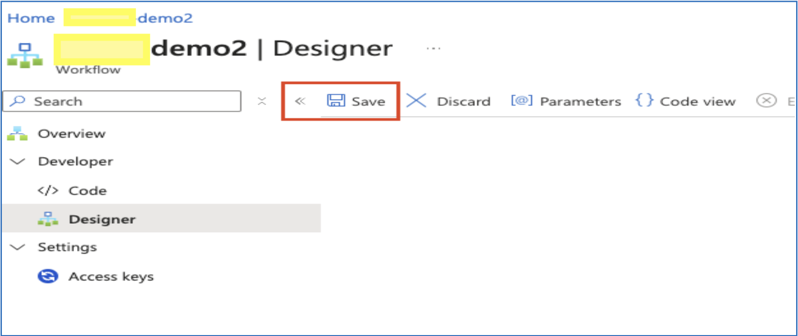
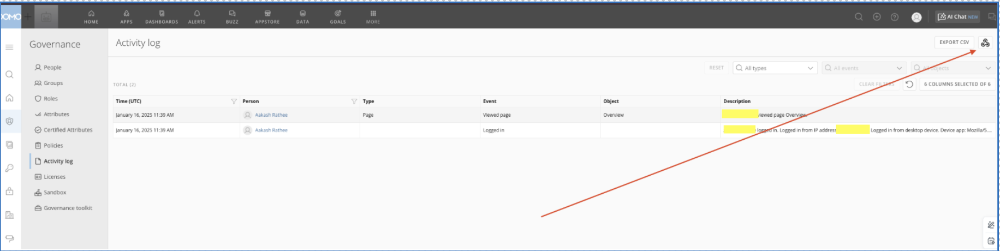
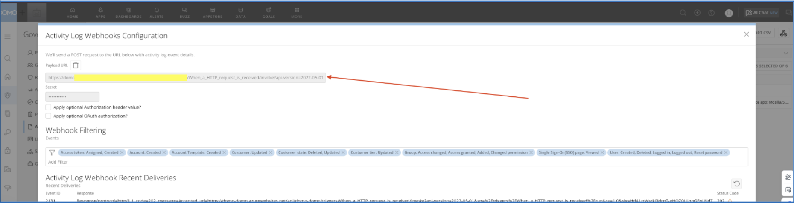
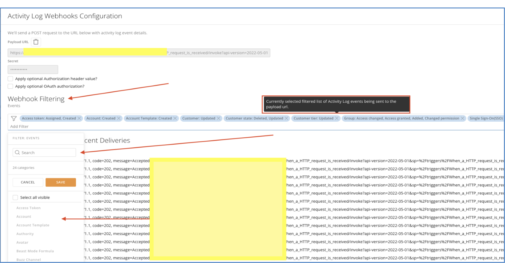

# SHIPPING TO LOGS TO SIEM 

## Domo Activity Logs 

Domo provides the Activity logs in which you can view events for all individuals in your instance. As well as you can ship these logs to SIEM to analysis and create alerts around the logs. 

This document focused on how you can send these logs to external SIEM solution using webhook. 

## Access the Activity Logs 

From the Admin Settings under <strong>Governance</strong>, select  <strong>Activity log</strong>. 

You can only view the Activity log if you have an Admin default security role or a custom role with the View Activity Logs grant enabled. 

## SHIP logs to SIEM 

In this document we are taking Sentinel as our SIEM solution, you can use any other SIEM as well if it supports integration using Webhook, which most of the SIEM solution supports. 

## Part I – Configure Sentinel to receive logs via Webhook. 

### STEP 1 

1. Go to Azure Portal. 
2. Search for Logic Apps and Open Logic Apps dashboard. 
3. Click the Add button on top.

4. Select the <strong>Resource Group</strong>, provide a useful <strong>Logic App Name</strong> and <strong>region</strong>. 
5. Select the Storage, Networking configuration and monitoring in next steps. 
6. Provide appropriate tags. 
7. Click Create to deploy the app. 

### STEP 2

1. Under <strong>Workflows</strong> click <strong>Workflows</strong>.

2. Click Add<strong>Add</strong> -> <strong>Add</strong>. 
3. Provide a useful name and choose <strong>Stateful</strong> or <strong>Stateless</strong> depending on your use case and Click <strong>CREATE</strong>.
4. Now select your created workflow. 
5. In the above selected workflow click <strong>Developer -> Designer</strong>. 

### STEP 3

1. Click <strong>Add-a-Trigger</strong>. 
2. In the search bar search for <strong>“When a HTTP request is received”</strong>. Click it. 
3. Select the method as <strong>POST</strong>

### STEP 4
1. Click the + sign. 
2. Search for <strong>Azure Log Analytics</strong> and then <strong>Send Data</strong>. 
3. In the <strong>Json Request Body</strong>, click <strong>Fx</strong>

4. After that click <strong>Dynamic Content</strong>Dynamic Content and then <strong>body</strong>.

5. Add a Custom Log Name which you want to keep for log table
6. Then Click <strong>Save</strong>, once you click save the webhook URL will appear.

7. You can see the webhook URL as shown in the below image.

## Part II – Configure Domo to send logs via Webhook. 

### STEP 1

Go to your Domo instance and sign in using your preferred method. 

### STEP 2

Once logged in go to <strong>More -> Admin</strong>. 

### STEP 3

Go to <strong>Activity Logs</strong> under <strong>Governance</strong>. 

### STEP 4

Once you click the <strong>Activity Logs</strong>, you will see all of the activity happening in your instance. 

Once on this page click the <strong>Webhook</strong> icon as shown in image below. 

### STEP 5

In the highlighted field enter your webhook URL as highlighted in image, if your webhook url has secret as well put it in the field below webhook URL. If webhook doesn’t require secret, enter any random value. 

### STEP 6

Here you will see the <strong>Webhook Filtering</strong> field as well. You can choose for which <strong>categories</strong> you want to forward the logs as well as to go more granule you can select the <strong>subfields</strong> under that category. 
 
<strong>NOTE:</strong> If you don’t select any field nothing will be forwarded. 

### STEP 7

Verify the logs from this dashboard itself. Once the logs are forwarded to webhook these logs will be available on the same page under <strong>Activity Log Webhook Recent Deliveries</strong>. 

That’s All! 